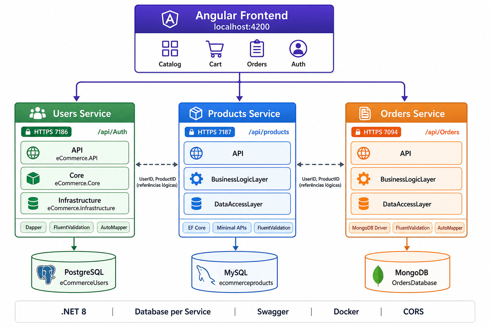
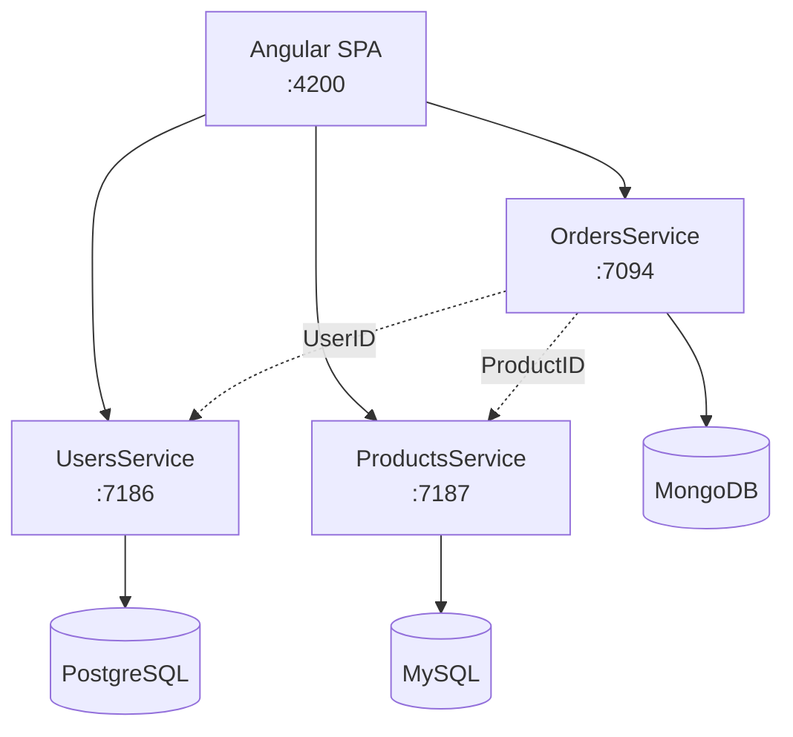

# e-Commerce Microservices

Solução de e-commerce distribuída com **3 microserviços .NET 8**, frontend **Angular 21** e persistência poliglota (PostgreSQL, MySQL e MongoDB). Cada serviço possui banco de dados próprio, deploy independente e responsabilidade de domínio bem definida.



---

## Visão geral

| Serviço | Domínio | Porta (HTTPS) | Banco | ORM / Acesso |
|---------|---------|---------------|-------|--------------|
| **UsersService** | Autenticação (register/login) | `7186` | PostgreSQL | Dapper |
| **ProductsService** | Catálogo de produtos (CRUD + busca) | `7187` | MySQL | Entity Framework Core |
| **OrdersService** | Pedidos e itens (CRUD + buscas) | `7094` | MongoDB | MongoDB Driver |
| **Frontend Angular** | UI SPA (catálogo, carrinho, pedidos) | `4200` | — | HttpClient |

---

## Estrutura do repositório

```
eCommerceMicroservice/
├── User/eCommerceSolution.UsersService/       # Microserviço de usuários
├── Product/eCommerceSolution.ProductsService/   # Microserviço de produtos
├── Order/eCommerceSolution.OrdersService/       # Microserviço de pedidos
├── microservice/                                # Frontend Angular
├── docker/                                      # Scripts de init dos bancos
├── docker-compose.yml                           # Orquestração local
├── .env.example                                 # Variáveis de ambiente
├── docs/
│   └── architecture-microservices.png           # Diagrama de arquitetura
└── mysql/                                       # Script legado MySQL (referência)
```

---

## Arquitetura em camadas (padrão comum)

Todos os microserviços seguem **arquitetura em 3 camadas** com inversão de dependência:

```
Cliente HTTP
    → API (Controllers / Minimal APIs)
        → Service Layer (regras de negócio)
            → Repository (abstração de dados)
                → Banco de dados
```

### Padrões utilizados

- **Repository Pattern** — abstrai o acesso a dados
- **Service Layer** — centraliza validação e regras de negócio
- **DTOs** — contratos de API separados das entidades
- **FluentValidation** — validação declarativa
- **AutoMapper** — mapeamento Request → Entity → Response
- **Exception Middleware** — respostas de erro padronizadas (`ApiErrorResponse`)
- **Dependency Injection** — extensões `AddDataAccessLayer()` / `AddCore()` / `AddBusinessLogicLayer()`

---

## Detalhes por microserviço

### UsersService

```
eCommerce.API
eCommerce.Core          → DTOs, Validators, Mappers, Services
eCommerce.Infrastructure → Dapper, PostgreSQL
```

| Método | Endpoint |
|--------|----------|
| `POST` | `/api/Auth/register` |
| `POST` | `/api/Auth/login` |

### ProductsService

```
ProductsMicroService.API
BusinessLogicLayer
DataAccessLayer          → EF Core, MySQL
```

| Método | Endpoint |
|--------|----------|
| `GET` | `/api/products` |
| `GET` | `/api/products/search/product-id/{id}` |
| `GET` | `/api/products/search/{termo}` |
| `POST` | `/api/products` |
| `PUT` | `/api/products` |
| `DELETE` | `/api/products/{id}` |

### OrdersService

```
API
BusinessLogicLayer
DataAccessLayer          → MongoDB Driver
```

| Método | Endpoint |
|--------|----------|
| `GET` | `/api/Orders` |
| `GET` | `/api/Orders/search/orderid/{id}` |
| `GET` | `/api/Orders/search/userid/{id}` |
| `GET` | `/api/Orders/search/productid/{id}` |
| `GET` | `/api/Orders/search/orderDate/{data}` |
| `POST` | `/api/Orders` |
| `PUT` | `/api/Orders/{id}` |
| `DELETE` | `/api/Orders/{id}` |

---

## Frontend Angular

SPA em **Angular 21** com **Angular Material**, consumindo os três microserviços:

| Funcionalidade | Rota | Microserviço |
|----------------|------|--------------|
| Login / Cadastro | `/auth/login`, `/auth/register` | Users |
| Catálogo e busca | `/products/showcase`, `/products/search/:str` | Products |
| Admin produtos | `/admin/products` | Products |
| Carrinho | `/cart` | Local (localStorage) |
| Finalizar pedido | checkout no carrinho | Orders |
| Meus pedidos | `/orders` | Orders |
| Admin pedidos | `/admin/orders` | Orders |

Configuração em `microservice/src/environment.ts`:

```typescript
apiUrl: 'https://localhost:7186/api/Auth/'
productsMicroserviceUrl: 'https://localhost:7187/api/products'
ordersMicroserviceUrl: 'https://localhost:7094/api/Orders'
```

---

## Pré-requisitos

- [.NET 8 SDK](https://dotnet.microsoft.com/download)
- [Node.js 20+](https://nodejs.org/) (frontend)
- [MySQL](https://www.mysql.com/) (Products)
- [PostgreSQL](https://www.postgresql.org/) (Users)
- [MongoDB](https://www.mongodb.com/) (Orders)
- Certificado de desenvolvimento HTTPS confiável (`dotnet dev-certs https --trust`)

### Bancos via Docker (opcional)

```bash
docker run -d -p 5432:5432 -e POSTGRES_PASSWORD=admin --name postgres postgres
docker run -d -p 3306:3306 -e MYSQL_ROOT_PASSWORD=admin --name mysql mysql:8
docker run -d -p 27017:27017 --name mongodb mongo
```

---

## Como executar

### 1. UsersService

```bash
dotnet run --project User/eCommerceSolution.UsersService/eCommerce.API/eCommerce.API.csproj
```

Swagger: `https://localhost:7186/swagger`

### 2. ProductsService

```bash
dotnet run --project Product/eCommerceSolution.ProductsService/ProductsMicroService.API/ProductsMicroService.API.csproj
```

Swagger: `https://localhost:7187/swagger`

### 3. OrdersService

```bash
dotnet run --project Order/eCommerceSolution.OrdersService/API/API.csproj
```

Swagger: `https://localhost:7094/swagger`

### 4. Frontend Angular

```bash
cd microservice
npm install
npm start
```

Aplicação: `http://localhost:4200`

### Login admin (frontend)

| Campo | Valor |
|-------|-------|
| Email | `admin@gmail.com` |
| Senha | `admin` |

---

## Fluxo de compra (cliente)

```
1. Registro ou login        → UsersService
2. Navegar catálogo         → ProductsService
3. Adicionar ao carrinho    → CartService (localStorage)
4. Finalizar pedido         → OrdersService (POST /api/Orders)
5. Ver histórico            → OrdersService (GET /search/userid/{id})
```

O pedido referencia `UserID` e `ProductID` **sem foreign keys entre bancos** — princípio *database per service* dos microserviços.

---

## Comunicação entre serviços



---

## Docker e Docker Compose

Stack completa (Angular + 3 APIs + PostgreSQL + MySQL + MongoDB) via Compose, com **database per service**, health checks e configuração externalizada. O frontend roda `npm ci` + `ng build` no build da imagem e é servido pelo nginx.

### Subir tudo

```bash
cp .env.example .env
docker compose up --build -d
```

| Serviço | URL (HTTP) | Swagger |
|---------|------------|---------|
| **Frontend Angular** | `http://localhost:4200` | — |
| UsersService | `http://localhost:7186` | `/swagger` |
| ProductsService | `http://localhost:7187` | `/swagger` |
| OrdersService | `http://localhost:7094` | `/swagger` |

```bash
# logs
docker compose logs -f

# parar e remover containers (volumes preservados)
docker compose down

# reset completo dos dados
docker compose down -v
```

### Estrutura Docker

```
docker-compose.yml
.env.example
docker/
├── postgres/init/01-users.sql      # schema Users + seed admin
└── mysql/init/01-products.sql      # schema Products + seed catálogo
microservice/
├── Dockerfile                      # npm ci + ng build → nginx
└── docker/nginx.conf               # SPA fallback
```

Cada API e o frontend possuem `Dockerfile` multi-stage. Exemplo manual (Orders):

```bash
docker build -t orders-service -f Order/eCommerceSolution.OrdersService/API/Dockerfile Order/eCommerceSolution.OrdersService
```

> **Nota:** as APIs no Docker usam **HTTP**. O `environment.ts` já aponta para `http://localhost:7186|7187|7094` — o browser chama as APIs no host (não pelos nomes dos containers).

---

## O que este projeto ensina

| Tópico | Onde praticar |
|--------|---------------|
| Microserviços e bounded contexts | 3 serviços independentes |
| Database per service | PostgreSQL + MySQL + MongoDB |
| Arquitetura em camadas | API / BLL / DAL em cada serviço |
| Polyglot persistence | Banco certo para cada domínio |
| Validação e mapeamento | FluentValidation + AutoMapper |
| API REST + Swagger | Todos os serviços |
| SPA multi-backend | Angular com 3 URLs |
| Carrinho e checkout | Fluxo e-commerce completo |

---
