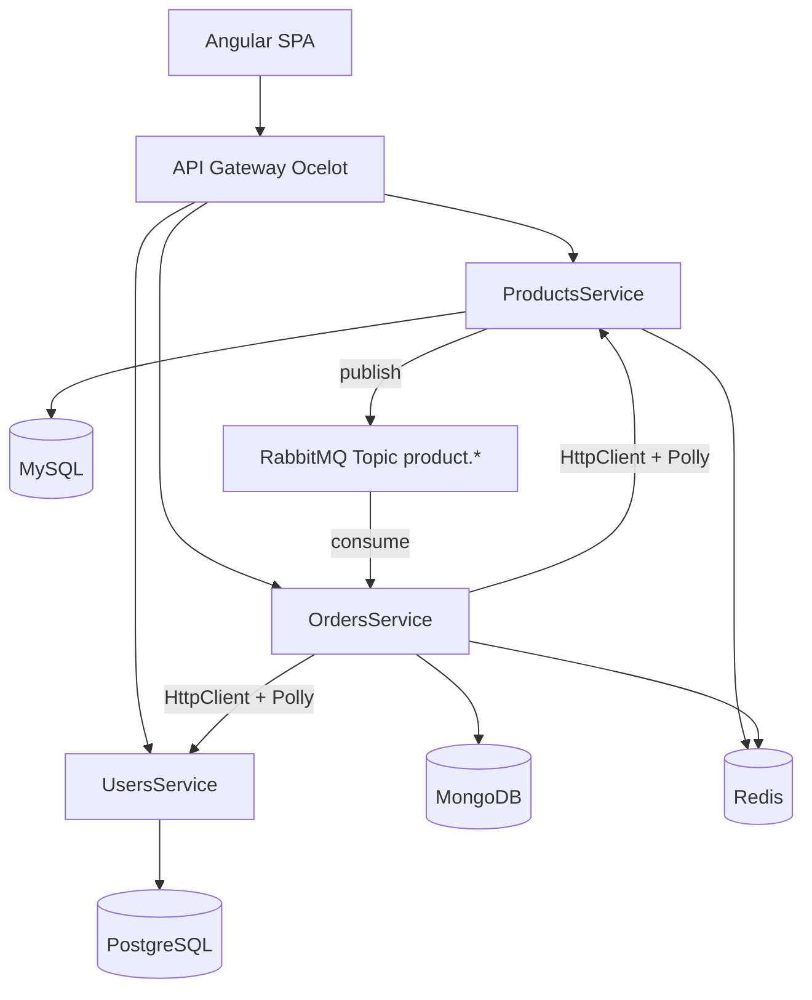

# e-Commerce Microservices

> **Dois deploys na Azure, o mesmo software.**  
> A stack sobe no **Docker Compose** (máquina), no **Azure Container Apps** (Environment `<ACA_ENVIRONMENT>`) e no **AKS** (cluster `<AKS_CLUSTER>`). O domínio não muda: o Angular fala só com o gateway; o Orders valida Users e Products com HttpClient + Polly; o Products publica `product.*` no RabbitMQ.

Solução de e-commerce distribuída com **3 microserviços .NET 8**, **API Gateway (Ocelot)**, **Redis**, **RabbitMQ**, frontend **Angular 21** e persistência poliglota (PostgreSQL, MySQL e MongoDB). Cada serviço possui banco próprio, deploy independente e responsabilidade de domínio bem definida.

O frontend fala **apenas com o gateway**. O **OrdersService** (dependant) chama **Users** e **Products** (dependencies) de forma **síncrona** via `HttpClient` + **Polly**, e mantém cache local sincronizado de forma **assíncrona** via **RabbitMQ**.


<hr>


<hr>

| Onde | O que o browser chama | Rede interna |
|------|------------------------|--------------|
| Compose | `http://localhost:4200` → gateway `:7010` | DNS `ecommerce-network` (`users-api`, `postgres`) |
| Container Apps | `npm run start:azure` → FQDN do `<ACA_GATEWAY>` | nomes dos Container Apps (`<ACA_USERS>`, `<ACA_POSTGRES>`) |
| AKS | Ingress (`/` frontend, `/api` e `/health` gateway) | Service DNS (`users-api.ecommerce.svc`, `postgres.ecommerce-data.svc`) |

---

## Visão geral

| Serviço | Domínio | Porta (Compose) | Banco / infra | Acesso |
|---------|---------|-----------------|---------------|--------|
| **ApiGateway (Ocelot)** | Roteamento, rate limit, file cache, QoS | `7010` | - | Upstream → Downstream |
| **UsersService** | Autenticação (register/login) | `7186` | PostgreSQL | Dapper |
| **ProductsService** | Catálogo de produtos (CRUD + busca) | `7187` | MySQL + Redis | EF Core |
| **OrdersService** | Pedidos e itens (CRUD + buscas) | `7094` | MongoDB + Redis | MongoDB Driver |
| **Redis** | Cache distribuído (`IDistributedCache`) | `6379` | Redis | StackExchange.Redis |
| **RabbitMQ** | Eventos de integração (cache sync) | `5672` / `15672` | RabbitMQ | `RabbitMQ.Client` |
| **Frontend Angular** | UI SPA (catálogo, carrinho, pedidos) | `4200` | - | HttpClient → Gateway |

O Ocelot escolhe o arquivo de rotas pelo `ASPNETCORE_ENVIRONMENT`:

| Ambiente | Arquivo | Downstream |
|----------|---------|------------|
| `Development` (`dotnet run`) | `ocelot.json` | `localhost:5034` / `5035` / `5194` |
| `Docker` (Compose e Container Apps) | `ocelot.docker.json` | `users-api:8080` no Compose; `<ACA_USERS>:80` no ACA |
| `Aks` | `ocelot.docker.aks.json` | `users-api` / `products-api` / `orders-api` na porta **80** |

---

## Estrutura do repositório

```
eCommerceMicroservice/
├── Gateway/eCommerceSolution.ApiGateway/        # Ocelot + Polly QoS
│   ├── ocelot.json                              # dotnet run
│   ├── ocelot.docker.json                       # Compose / Container Apps
│   └── ocelot.docker.aks.json                   # AKS
├── User/eCommerceSolution.UsersService/
├── Product/eCommerceSolution.ProductsService/
├── Order/eCommerceSolution.OrdersService/
├── microservice/                                # Angular 21
│   ├── src/environment.ts                       # localhost:7010
│   ├── src/environment.azure.ts                 # gateway ACA
│   └── src/environment.aks.ts                   # Ingress do AKS
├── docker/                                      # init Postgres / MySQL (+ imagens :init)
├── docker-compose.yml
├── k8s/                                         # Deployments, StatefulSets, Ingress
├── .env.example
├── docs/
│   ├── final-project.png
│   ├── architecture-microservices.png
│   └── roteiro-aca-depois-aks.md                # ordem dos comandos ACA → AKS
└── .github/workflows/ci.yml                     # hoje: dotnet build
```

---

## Arquitetura em camadas (padrão comum)

Todos os microserviços seguem **arquitetura em 3 camadas** com inversão de dependência:

```
Cliente HTTP (Angular)
    → API Gateway (Ocelot)
        → API (Controllers / Minimal APIs)
            → Service Layer (regras de negócio)
                → Repository (abstração de dados)
                    → Banco de dados
```

### Padrões utilizados

- **API Gateway** - Ocelot (Upstream/Downstream, rate limit, file cache, QoS)
- **Fault tolerance** - Polly no HttpClientFactory (dependant → dependency)
- **Distributed cache** - Redis via `IDistributedCache` + StackExchange.Redis
- **Async messaging** - RabbitMQ Topic Exchange (`product.*`) para sincronizar cache entre serviços
- **Repository Pattern** - abstrai o acesso a dados
- **Service Layer** - centraliza validação e regras de negócio
- **DTOs** - contratos de API separados das entidades (`FaultDTO` no fallback)
- **FluentValidation** - validação declarativa
- **AutoMapper** - mapeamento Request → Entity → Response
- **Exception Middleware** - respostas de erro padronizadas (`ApiErrorResponse`)
- **Dependency Injection** - extensões `AddDataAccessLayer()` / `AddCore()` / `AddBusinessLogicLayer()`

---

## Detalhes por microserviço

### UsersService

```
eCommerce.API
eCommerce.Core          → DTOs, Validators, Mappers, Services
eCommerce.Infrastructure → Dapper, PostgreSQL
```

| Método | Endpoint |
|--------|----------|
| `POST` | `/api/Auth/register` |
| `POST` | `/api/Auth/login` |
| `GET` | `/api/Users/{userID}` |

### ProductsService

```
ProductsMicroService.API
BusinessLogicLayer      → cache-aside Redis (`IDistributedCache`)
DataAccessLayer         → EF Core, MySQL
```

| Método | Endpoint |
|--------|----------|
| `GET` | `/api/products` |
| `GET` | `/api/products/search/product-id/{id}` |
| `GET` | `/api/products/search/{termo}` |
| `POST` | `/api/products` |
| `PUT` | `/api/products` |
| `DELETE` | `/api/products/{id}` |

Cache Redis: chave `$"{id}"` (com `InstanceName = Products_`) e `"all"` para o catálogo. TTL 60s. Invalidação em create/update/delete. Se o Redis cair, a leitura vai ao MySQL.

### OrdersService

```
API
BusinessLogicLayer      → Polly + HttpClientFactory + cache-aside Redis
DataAccessLayer         → MongoDB Driver
```

| Método | Endpoint |
|--------|----------|
| `GET` | `/api/Orders` |
| `GET` | `/api/Orders/search/orderid/{id}` |
| `GET` | `/api/Orders/search/userid/{id}` |
| `GET` | `/api/Orders/search/productid/{id}` |
| `GET` | `/api/Orders/search/orderDate/{data}` |
| `POST` | `/api/Orders` |
| `PUT` | `/api/Orders/{id}` |
| `DELETE` | `/api/Orders/{id}` |

**Dependant:** OrdersService. **Dependencies:** UsersService e ProductsService.

Políticas Polly combinadas (`Policy.WrapAsync`), registradas com `AddPolicyHandler` no typed `HttpClient`:

| Política | O que faz |
|----------|-----------|
| **Wait and Retry** | 3 tentativas, exponential backoff (200ms, 400ms, 800ms) em erros *transient* |
| **Timeout** | 3s por tentativa (async / pessimistic) |
| **CircuitBreaker** | abre após 3 falhas; *duration of break* 15s |
| **Bulkhead Isolation** | `MaxParallelization = 5`, `MaxQueuingActions = 10` |
| **Fallback** | devolve `FaultDTO` + header `X-Fallback: true` (HTTP 503) |

Ordem outer → inner: `Fallback → CircuitBreaker → WaitAndRetry → Bulkhead → Timeout`.

### API Gateway (Ocelot)

Ponto único para o frontend.

```csharp
builder.Services.AddOcelot(builder.Configuration).AddPolly();
await app.UseOcelot();
```

| Conceito | Onde |
|----------|------|
| Upstream / Downstream | cada rota no JSON do Ocelot |
| `RateLimitOptions` | limite por rota (ex.: 5 GET/s em produtos) |
| `ClientWhitelist` + `ClientIdHeader` | `ClientId: admin-client` ignora o limite |
| `FileCacheOptions` (`TtlSeconds`, `Region`) | cache GET de produtos/users (15 a 20s) |
| `QoSOptions` | timeout + circuit breaker Polly no gateway |

Health check: `GET /health` → `{"status":"ok","service":"api-gateway"}`.  
`GET /api` sozinho devolve **404**: não existe rota cujo path seja exatamente `/api`. Use `/api/products`, `/api/Auth/login`, `/api/Orders`.

---

## Frontend Angular

SPA em **Angular 21** com **Angular Material**. Todas as URLs apontam para o **gateway**.

| Arquivo | Quando | Gateway |
|---------|--------|---------|
| `src/environment.ts` | `npm start` / Compose | `http://localhost:7010` |
| `src/environment.azure.ts` | `npm run start:azure` | HTTPS do `<ACA_GATEWAY>` |
| `src/environment.aks.ts` | build `aks-prod` | IP do Ingress (`/api/Auth/`, `/api/products`, `/api/Orders`) |

No `angular.json`, `azure-prod` troca o environment pelo do Container Apps; `aks-prod` troca pelo do AKS. O Dockerfile do frontend recebe `BUILD_CONFIGURATION`.

### Observer Pattern (Signals + RxJS)

| Serviço | Papel | Mecanismo |
|---------|-------|-----------|
| `CartService` | Carrinho (localStorage) | `signal` + `computed` (`itemCount`, `totalAmount`, `feedbackMessage`) |
| `ProductsService` | Catálogo em memória | `signal` + `computed` (`catalog`, `loading`, `error`, `hasProducts`) |
| Componentes | Views | Observam signals no template |
| HTTP | Chamadas à API | RxJS (`subscribe`, `tap`) |

Adicionar produto ao carrinho na vitrine atualiza o badge na sidebar **sem refresh**. Navegar entre vitrine e admin **não refaz GET** até um CRUD invalidar.

| Funcionalidade | Rota | Downstream |
|----------------|------|------------|
| Login / Cadastro | `/auth/login`, `/auth/register` | Users |
| Catálogo e busca | `/products/showcase`, `/products/search/:str` | Products |
| Admin produtos | `/admin/products` | Products |
| Carrinho | `/cart` | Local (localStorage) |
| Finalizar pedido | checkout no carrinho | Orders |
| Meus pedidos | `/orders` | Orders |
| Admin pedidos | `/admin/orders` | Orders |

Swagger continua nas portas diretas dos microserviços (não passa pelo gateway).

Login de laboratório: `admin@gmail.com` / `admin` (seed do Postgres).

---

## Fluxo de compra (cliente)

```
1. Registro ou login        → Gateway → UsersService
2. Navegar catálogo         → Gateway → ProductsService (file cache + Redis)
3. Adicionar ao carrinho    → CartService (localStorage)
4. Finalizar pedido         → Gateway → OrdersService (POST /api/Orders)
5. Ver histórico            → Gateway → OrdersService (GET /search/userid/{id})
```

O pedido referencia `UserID` e `ProductID` **sem foreign keys entre bancos** (princípio *database per service*).

---

## Comunicação entre serviços

| Quando | Como | Exemplo |
|--------|------|---------|
| Precisa da resposta **agora** | HTTP síncrono + Polly | Validar user/produto e enriquecer pedido |
| Manter **cópia local atualizada** | RabbitMQ + Redis | Orders sincroniza cache após CRUD no Products |

Essa conversa **não passa pelo Ocelot**. Orders chama Users e Products pelo hostname interno da plataforma (Compose, Container App ou Service do Kubernetes).

| De (dependant) | Para (dependency) | Endpoint | Uso |
|----------------|-------------------|----------|-----|
| Orders | Users | `GET /api/Users/{userID}` | Validar UserID + enriquecer `PersonName` / `Email` |
| Orders | Products | `GET /api/products/search/product-id/{productID}` | Validar ProductID + enriquecer `ProductName` / `Category` |

Depois do commit no MySQL, o **ProductsService publica** um evento. O **OrdersService consome** (`IHostedService`) e atualiza ou remove a chave no Redis.

| Peça | Valor |
|------|-------|
| Exchange | `ecommerce.products` (Topic, durable) |
| Routing keys | `product.created` / `product.updated` / `product.deleted` |
| Fila | `orders.product-cache` |
| Binding | `product.*` |
| Payload | JSON `ProductEventMessage` |
| Ack | `autoAck: false` (`BasicAck` após gravar no Redis) |

Se a publicação falhar, o CRUD HTTP **não quebra**.


```mermaid
flowchart TB
    Angular["Angular SPA"]
    Gateway["API Gateway Ocelot"]

    Users["UsersService"]
    Products["ProductsService"]
    Orders["OrdersService"]

    PG[("PostgreSQL")]
    MySQL[("MySQL")]
    Mongo[("MongoDB")]
    Redis[("Redis")]
    RMQ["RabbitMQ Topic product.*"]

    Angular --> Gateway
    Gateway --> Users
    Gateway --> Products
    Gateway --> Orders

    Users --> PG
    Products --> MySQL
    Products --> Redis
    Products -->|"publish"| RMQ
    Orders --> Mongo
    Orders --> Redis
    RMQ -->|"consume"| Orders

    Orders -->|"HttpClient + Polly"| Users
    Orders -->|"HttpClient + Polly"| Products
```

---

## Redes: três runtimes, o mesmo desenho

A loja tem **duas redes mentais**. A de aplicação (quem chama quem) é idêntica nas três plataformas. A de infraestrutura (DNS, porta, o que a internet vê) muda.

### Rede de aplicação (não muda)

```
Browser
  └── só o gateway (HTTP)
        ├── Users
        ├── Products
        └── Orders
              ├── Users (HTTP + Polly, sem Ocelot)
              └── Products (HTTP + Polly, sem Ocelot)

Products - AMQP 5672 ──► RabbitMQ - AMQP ──► Orders
Products e Orders - TCP 6379 ──► Redis
Users - 5432 ──► Postgres
Products - 3306 ──► MySQL
Orders - 27017 ──► Mongo
```

### O que cada plataforma troca

| Ideia | Docker Compose | Container Apps | AKS |
|-------|----------------|----------------|-----|
| Rede | bridge `ecommerce-network` | Environment `<ACA_ENVIRONMENT>` | cluster + namespaces |
| DNS do Users | `users-api` | `<ACA_USERS>` | `users-api.ecommerce.svc.cluster.local` |
| DNS do Postgres | `postgres` | `<ACA_POSTGRES>` | `postgres.ecommerce-data.svc.cluster.local` |
| Porta HTTP interna das APIs | **8080** no container | ingress **80** → target **8080** | Service **80** → target **8080** |
| Disco | volume nomeado | filesystem da réplica (efêmero no lab) | PVC `managed-csi` |
| O que a internet vê | portas no `localhost` | FQDN de cada app com ingress externo | **um** IP de Ingress |
| IPs dos processos | IP do container na bridge | IP da réplica (não use) | Pod `10.244.x.x` (não use do browser) |

No AKS, `kubectl get pods -n ecommerce -o wide` mostra `10.244.x.x`. Esses endereços existem só entre os nodes. `http://<POD_IP>` no Chrome da sua máquina não abre. O único IPv4 público é o `ADDRESS` do Ingress (`kubectl get ingress -n ecommerce`).

No esquema antigo de classes IPv4, um endereço que começa com `4` (bloco anunciado pela Microsoft) é “classe A”, assim como a faixa privada `10.0.0.0/8`. Isso **não** descreve o tamanho do cluster: `10.244` é interno; o `ADDRESS` do Ingress é o público.

### Portas que importam

| Porta | Protocolo | Quem usa | Pode ser pública? |
|-------|-----------|----------|-------------------|
| 80 / 8080 | HTTP | APIs .NET e nginx do frontend | só a borda (7010, FQDN do gateway, Ingress) |
| 5432 | TCP | Postgres | não |
| 3306 | TCP | MySQL | não |
| 27017 | TCP | MongoDB | não |
| 6379 | TCP | Redis | não |
| **5672** | AMQP | Products publica, Orders consome | não |
| 15672 | HTTP | UI do RabbitMQ | só local / port-forward |

A UI **15672** não substitui o AMQP **5672**. No lab ACA, expor só a 15672 quebrou o `<ACA_PRODUCTS>`.

---

## Docker Compose (desenvolvimento local)

O `docker-compose.yml` é o contrato da stack: onze processos, uma rede, volumes e healthcheck. Se o Compose não sobe, Container Apps e AKS falham no mesmo ponto.

### Princípios no arquivo

- Um container = uma responsabilidade
- `ecommerce-network` (bridge): DNS pelo nome do serviço
- Volumes `postgres_data`, `mysql_data`, `mongodb_data`, `redis_data`, `rabbitmq_data`
- `healthcheck` + `depends_on: condition: service_healthy` - Orders espera Mongo, Redis e Rabbit
- Config no `.env` (copie de `.env.example`)
- Init em `docker/postgres/init` e `docker/mysql/init`
- APIs escutam `http://+:8080`; o host publica 7186 / 7187 / 7094 / 7010

### Subir

```bash
cp .env.example .env
docker compose up --build -d
```

| Serviço | URL | Health / UI |
|---------|-----|-------------|
| Frontend | http://localhost:4200 | - |
| Gateway | http://localhost:7010 | `/health` |
| Users | http://localhost:7186 | `/swagger` |
| Products | http://localhost:7187 | `/swagger` |
| Orders | http://localhost:7094 | `/swagger` |
| RabbitMQ UI | http://localhost:15672 | usuário/senha do `.env` |

```bash
docker compose logs -f
docker compose down          # volumes preservados
docker compose down -v       # reset dos dados
```

### `dotnet run` (só as APIs)

```bash
docker compose up postgres mysql mongodb redis -d
dotnet run --project User/eCommerceSolution.UsersService/eCommerce.API/eCommerce.API.csproj
dotnet run --project Product/eCommerceSolution.ProductsService/ProductsMicroService.API/ProductsMicroService.API.csproj
dotnet run --project Order/eCommerceSolution.OrdersService/API/API.csproj
dotnet run --project Gateway/eCommerceSolution.ApiGateway/ApiGateway.csproj
```

O `ocelot.json` aponta para 5034 / 5035 / 5194. Frontend: `cd microservice && npm install && npm start`.

---

## Azure Container Apps

O Environment é a rede compartilhada. Apps no mesmo Environment resolvem uns aos outros pelo **nome do Container App**. Não há YAML de Pod. Cada app é um recurso da Azure (`az containerapp create` / `update --image`).

Comandos na ordem (ACA e depois AKS), copiáveis: [`docs/roteiro-aca-depois-aks.md`](docs/roteiro-aca-depois-aks.md).

Ordem de subida no ACA (cada passo espera `Running`):

1. `az group create` + `az acr create` + `az acr login`
2. `docker build` / `docker push` das imagens `:aca` e `:init` (Postgres/MySQL com seed)
3. `az containerapp env create` — confirme com `az containerapp env list`
4. Infra TCP interno: Postgres → MySQL → MongoDB → Redis → RabbitMQ (**5672**, não 15672)
5. `users-api-app` (hostname do `ocelot.docker.json`)
6. `products-api-app`
7. `orders-api-app` (Users/Products por HTTP interno, sem Ocelot)
8. `api-gateway-app` com `ASPNETCORE_ENVIRONMENT=Docker`
9. `npm run start:azure` na máquina (FQDN do gateway em `environment.azure.ts`)

### Lab publicado

| Recurso | Valor |
|---------|--------|
| Resource group | `<RESOURCE_GROUP_ACA>` |
| Environment | `<ACA_ENVIRONMENT>` |
| FQDN do gateway | `https://<ACA_GATEWAY>.<HASH>.<REGIAO>.azurecontainerapps.io` |

Confirme o Environment com `az containerapp env list -g <RESOURCE_GROUP_ACA>`. Não use o nome truncado do portal.

| App | Papel | Ingress |
|-----|--------|---------|
| `<ACA_GATEWAY>` | Ocelot | HTTP **externo** |
| `<ACA_USERS>` | Auth | HTTP externo |
| `<ACA_PRODUCTS>` | Catálogo | HTTP externo |
| `<ACA_ORDERS>` | Pedidos | HTTP externo |
| `<ACA_POSTGRES>` | Users | TCP interno 5432 |
| `<ACA_MYSQL>` | Products | TCP interno 3306 |
| `<ACA_MONGO>` | Orders | TCP interno 27017 |
| `<ACA_REDIS>` | Cache | TCP interno 6379 |
| `<ACA_RABBIT>` | AMQP | TCP interno **5672** |

No ACA, HTTP interno usa a **porta 80** do ingress, que encaminha ao `targetPort` 8080. Por isso o `ocelot.docker.json` no Azure usa `users-api-app:80` (e os pares `products-api-app` / `orders-api-app`). O roteiro cria os Container Apps com esses nomes.

Variáveis (mesmo contrato do Compose, hostnames Azure):

```text
ConnectionStrings__PostgresConnection=Host=<ACA_POSTGRES>;Port=5432;Database=eCommerceUsers;...
MYSQL_HOST=<ACA_MYSQL>
ConnectionStrings__Redis=<ACA_REDIS>:6379
RabbitMQ__HostName=<ACA_RABBIT>
UsersMicroserviceBaseUrl=http://<ACA_USERS>
ProductsMicroserviceBaseUrl=http://<ACA_PRODUCTS>
```

Frontend no lab ACA: o Angular roda na máquina (`npm run start:azure`) e chama o HTTPS do gateway. Editar o Ocelot local só vale depois de rebuild + push + `az containerapp update --image`.

### Disco e seed

Sem volume, o disco da réplica é **efêmero**. `min-replicas 0` no Postgres/MySQL apaga Users e Products. Imagens oficiais só rodam `/docker-entrypoint-initdb.d` se os scripts estiverem **dentro da imagem** e o data dir nascer vazio.

Já existem `docker/postgres/Dockerfile` e `docker/mysql/Dockerfile`. Build/push no ACR e `az containerapp update --image ...:init` fazem o seed (admin + 12 produtos) voltar sozinho no scale 0→1.

Mongo cria coleção no uso. Redis vazio é aceitável. Exchange e fila do Rabbit nascem no publisher/consumer .NET.

### Lições do lab ACA

1. `--args` com hífen o Azure CLI engole como flag própria.
2. `GET /` no gateway é 404 esperado; use `/health` e `/api/...`.
3. 503 no Ocelot é QoS/Polly quando o downstream falha ou demora.
4. Rabbit UI ≠ AMQP: duas portas.
5. Testar falha de banco: `az containerapp update -n <ACA_MYSQL> --min-replicas 0 --max-replicas 0`.

Roteiro com os comandos: [`docs/roteiro-aca-depois-aks.md`](docs/roteiro-aca-depois-aks.md).

### Ligar e desligar (custo)

Pausar tudo (perde disco efêmero):

```bash
RG=<RESOURCE_GROUP_ACA>
for APP in <ACA_GATEWAY> <ACA_USERS> <ACA_PRODUCTS> <ACA_ORDERS> \
           <ACA_POSTGRES> <ACA_MYSQL> <ACA_MONGO> <ACA_REDIS> <ACA_RABBIT>
do
  az containerapp update -g $RG -n $APP --min-replicas 0 --max-replicas 0
done
```

Para manter Users/Products uma noite, deixe a **infra** em `min-replicas 1` e pause só as APIs.

---

## Kubernetes (AKS)

O recurso da Azure é **um** cluster (`<AKS_CLUSTER>` em `<RESOURCE_GROUP_AKS>`). Cada `kubectl apply -f k8s/*.yaml` coloca um processo **dentro** dele. Não nasce um Container App por serviço.

### Conceitos neste projeto

| Objeto | Papel aqui |
|--------|------------|
| **Cluster / node** | Plano de controle gerenciado + VMs do tamanho permitido na região. Dois nodes cabem a stack. |
| **kubectl** | Cliente do plano de controle. `az` cria o AKS; `kubectl` cria Pods. |
| **Namespace** | `ecommerce` (APIs + frontend) e `ecommerce-data` (bancos, Redis, Rabbit). |
| **Pod** | Um processo. Label `app: gateway` liga ao Service. |
| **Deployment** | frontend, gateway, users, products, orders. Recria o Pod se cair. |
| **StatefulSet** | postgres, mysql, mongodb, redis, rabbitmq. Nome `postgres-0` + disco. |
| **Service ClusterIP** | DNS estável. Porta 80 → 8080 nas APIs. Sem IP público. |
| **Ingress** | Classe `webapprouting.kubernetes.azure.com`. `/` → frontend; `/api` e `/health` → gateway. |
| **PVC** | Disco Azure (`managed-csi`). Restart do Pod **não** apaga o banco. |
| **readinessProbe** | Gateway: `GET /health`. Banco: `pg_isready` / `mysqladmin ping` / `mongosh ping`. |

`az aks create` precisa do provedor `Microsoft.ContainerService` registrado (`az provider register --namespace Microsoft.ContainerService --wait`). O Container Apps usa `Microsoft.App` - por isso o Environment já existia sem esse registro.

Escolha um SKU de node permitido na sua região (`az aks get-versions` / a lista do erro de `az aks create`). `--attach-acr` autoriza o node a puxar imagem sem senha no manifesto. `--tier free` não cobra o plano de controle; o **node cobra** com a loja parada.

### Pasta `k8s/`

| Arquivo | Kind | Namespace |
|---------|------|-----------|
| `gateway.yaml` | Deployment + Service | ecommerce |
| `users.yaml` / `products.yaml` / `orders.yaml` / `frontend.yaml` | Deployment + Service | ecommerce |
| `ingress.yaml` | Ingress | ecommerce |
| `postgres.yaml` / `mysql.yaml` / `mongodb.yaml` / `redis.yaml` / `rabbitmq.yaml` | StatefulSet + Service | ecommerce-data |

No Git as imagens das APIs vão **sem** o hostname do ACR (`ecommerce-postgres:init`). No cluster local, o node precisa do registry completo (`<acr>.azurecr.io/...`).

Ordem de subida (cada passo espera `Running` / health). Comandos copiáveis em [`docs/roteiro-aca-depois-aks.md`](docs/roteiro-aca-depois-aks.md).

1. `az aks create --attach-acr` + `az aks get-credentials` (provedor `Microsoft.ContainerService`)
2. `docker build` / `docker push` com tag `:aks-v1` / `:aks-v2` e prefixo `<acr>.azurecr.io/`
3. Namespaces `ecommerce` e `ecommerce-data`
4. Gateway (`k8s/gateway.yaml`, prova `/health` via `port-forward`)
5. Postgres (`PGDATA=/var/lib/postgresql/data/pgdata`) → users-api
6. MySQL, Redis, RabbitMQ → products-api
7. MongoDB → orders-api
8. O Deployment do gateway já usa `ASPNETCORE_ENVIRONMENT=Aks` (`ocelot.docker.aks.json`)
9. `az aks approuting enable` + `kubectl apply -f k8s/ingress.yaml` (pegue o `ADDRESS`)
10. Frontend compilado com `aks-prod` (IP do Ingress gravado no JS) → `k8s/frontend.yaml`

O disco Azure ext4 nasce com `lost+found`. O `initdb` do Postgres recusa o mount point. Por isso `PGDATA` aponta para o subdiretório `pgdata`.

### Hosts que o código já lê

| Variável | Compose | Container Apps | AKS |
|----------|---------|----------------|-----|
| Users (Orders) | `http://users-api:8080` | `http://<ACA_USERS>` | `http://users-api.ecommerce.svc.cluster.local` |
| Products (Orders) | `http://products-api:8080` | `http://<ACA_PRODUCTS>` | `http://products-api.ecommerce.svc.cluster.local` |
| `MYSQL_HOST` | `mysql` | `<ACA_MYSQL>` | `mysql.ecommerce-data.svc.cluster.local` |
| `MONGODB_HOST` | `mongodb` | `<ACA_MONGO>` | `mongodb.ecommerce-data.svc.cluster.local` |
| Redis | `redis:6379` | `<ACA_REDIS>:6379` | `redis.ecommerce-data.svc.cluster.local:6379` |
| `RabbitMQ__HostName` | `rabbitmq` | `<ACA_RABBIT>` | `rabbitmq.ecommerce-data.svc.cluster.local` |

### Ingress e frontend

```bash
az aks approuting enable -g <RESOURCE_GROUP_AKS> -n <AKS_CLUSTER>
kubectl apply -f k8s/ingress.yaml
kubectl get ingress -n ecommerce
```

`ADDRESS` vazio nos primeiros minutos é normal. Quando o IP aparecer:

```bash
curl -s http://INGRESS_IP/health
curl -s http://INGRESS_IP/api/products | head -c 300
```

Antes do Ingress: `kubectl port-forward -n ecommerce svc/gateway 7010:80` e `npm start` (environment.ts).

O 503 do nginx do Ingress aparece se o Pod do frontend ainda não está Ready (`ImagePullBackOff` se a imagem não chegou ao ACR). 502 em `/api/products` com log `Name or service not known (<ACA_PRODUCTS>)` significa que o gateway ainda está em `Docker` e lê o Ocelot do Container Apps. O Deployment precisa de `ASPNETCORE_ENVIRONMENT=Aks`.

### Ligar e desligar (custo)

`kubectl scale --replicas=0` tira os Pods. PVC e Ingress ficam. As VMs **continuam cobrando**.

```bash
az aks stop -g <RESOURCE_GROUP_AKS> -n <AKS_CLUSTER>
az aks start -g <RESOURCE_GROUP_AKS> -n <AKS_CLUSTER>
az aks get-credentials -g <RESOURCE_GROUP_AKS> -n <AKS_CLUSTER>
kubectl get ingress -n ecommerce
```

No `start`, o IP do Ingress **pode mudar**. Ajuste `environment.aks.ts` e refaça o build do frontend. Apagar `<RESOURCE_GROUP_AKS>` não mexe em `<RESOURCE_GROUP_ACA>`.

---

## Comparação Compose  x  Container Apps  x  AKS

| Ideia | Compose | Container Apps | AKS |
|-------|---------|----------------|-----|
| Onde vive | containers na máquina | réplicas no Environment | Pods nos nodes |
| Quem cria o processo | `docker compose up` | `az containerapp create` | `kubectl apply` |
| Um serviço = um recurso Azure? | não | **sim** | **não** (só o cluster) |
| Disco do banco | volume nomeado | efêmero no lab | PVC |
| Scale to 0 barato | `compose down` | `min-replicas 0` | `az aks stop` (senão o node cobra) |
| APIs na internet | portas no host | quatro FQDNs externos | só o Ingress |
| Arquivo Ocelot | `ocelot.docker.json` | o mesmo (`*:80`) | `ocelot.docker.aks.json` |
| Quando escolher | desenvolver | publicar rápido | manifesto, disco, uma porta, GitOps |

O Environment pode ficar no ar depois que o Ingress do AKS já responde. São laboratórios lado a lado.

---

## Pré-requisitos

- [.NET 8 SDK](https://dotnet.microsoft.com/download)
- [Node.js 20+](https://nodejs.org/)
- [Docker](https://www.docker.com/)
- Azure CLI (`az`) para os labs de nuvem
- `kubectl` (`az aks install-cli`) para o AKS
- Certificado HTTPS de desenvolvimento só se chamar as APIs em HTTPS direto (`dotnet dev-certs https --trust`)

---

## Como testar cada conceito

Com a stack no ar (`docker compose up -d`). Troque IDs pelos valores do seed ou do Swagger.

### 1. Gateway  -  Upstream / Downstream

```bash
curl -i http://localhost:7010/health
curl -i http://localhost:7010/api/products
```

O path **upstream** (`/api/products`) é o que o frontend chama. O Ocelot encaminha **downstream** para `products-api:8080`. Compare: `curl -i http://localhost:7187/api/products`.

### 2. Rate limit (`RateLimitOptions`)

O GET de produtos aceita **5 req/s**. A 6ª deve responder **429**. Headers: `X-Rate-Limit-Limit`, `Retry-After`.

### 3. Client whitelist (`ClientIdHeader`)

O cliente `admin-client` **não** é limitado. Sem o header, o limite vale por IP.

### 4. File cache no gateway

1. `GET http://localhost:7010/api/products` (cache 15s, região `products`)
2. Altere o produto **direto** no Products (`PUT :7187`)
3. `GET` pelo gateway ainda vê o valor antigo até o TTL
4. `GET` em `:7187` já vê o novo

### 5. Redis

1ª leitura: miss → MySQL → `SetString`. 2ª: hit (`Products_*`). Update/delete invalidam `"all"` e `$"{id}"`. Com Redis parado, a API segue pelo MySQL.

```bash
docker compose stop redis
curl -i http://localhost:7187/api/products
docker compose start redis
```

### 6-9. Polly (retry, circuit, fallback, bulkhead)

```bash
docker compose stop products-api
curl -i http://localhost:7094/api/Orders
docker compose logs orders-api --tail=50
```

Procure WaitAndRetry, depois Fallback + `FaultDTO`. Repita a listagem para abrir o circuito (3 falhas, break 15s). Fallback devolve HTTP 503 + `X-Fallback: true`. Bulkhead: 5 em paralelo + fila 10; a 16ª cai em `BulkheadRejectedException`.

### 10. QoS no gateway

Com Products parado, o Ocelot também abre o circuito da rota. `TimeoutValue` e `DurationOfBreak` estão em **milissegundos**.

### 11. Combined policies

`Fallback → CircuitBreaker → WaitAndRetry → Bulkhead → Timeout`

### 12. RabbitMQ

1. UI: `http://localhost:15672`
2. Exchange `ecommerce.products`, fila `orders.product-cache`, bind `product.*`
3. CRUD no Products; logs de publish/consume; chaves `Orders_*` no Redis

Laboratório guiado: `./scripts/lab.sh`

### 13. Frontend ponta a ponta

`http://localhost:4200` → login admin → catálogo → carrinho → checkout. DevTools: APIs em `localhost:7010`.

No AKS, o mesmo fluxo usa o IP do Ingress. No ACA, `npm run start:azure`.

---

## O que este projeto ensina

| Tópico | Onde praticar |
|--------|---------------|
| Microserviços e bounded contexts | 3 serviços independentes |
| API Gateway (Ocelot) | três JSONs: local, Docker/ACA, AKS |
| Rate limiting / file cache / QoS | `ocelot.*.json` |
| Fault tolerance + Polly | Orders → Users / Products |
| Redis + RabbitMQ | cache-aside e `product.*` |
| Observer (frontend) | Signals + RxJS |
| Database per service | PostgreSQL + MySQL + MongoDB |
| Rede Compose | `ecommerce-network`, healthcheck, volumes |
| Rede Container Apps | Environment, ingress 80→8080, AMQP 5672 |
| Rede Kubernetes | ClusterIP, Ingress, Pod `10.244`, PVC |
| Disco efêmero vs persistente | scale 0 no ACA  x  PVC no AKS |
| Um recurso Azure vs um cluster | Container App  x  `kubectl apply` |

O CI em `.github/workflows/ci.yml` ainda só faz `dotnet build`. O próximo passo é build/push da imagem (tag = SHA) e `kubectl set image`.
