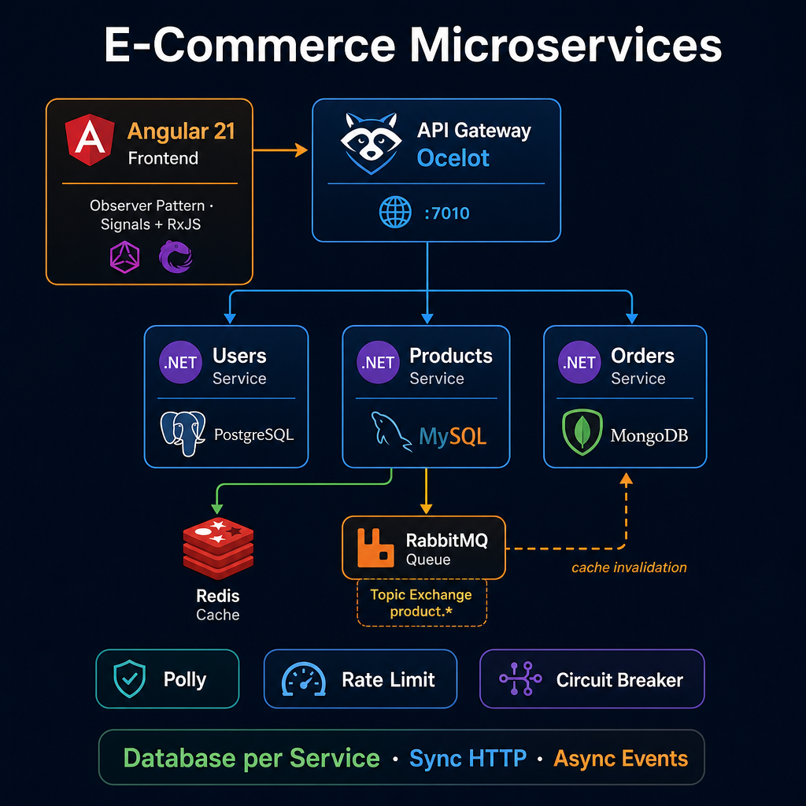
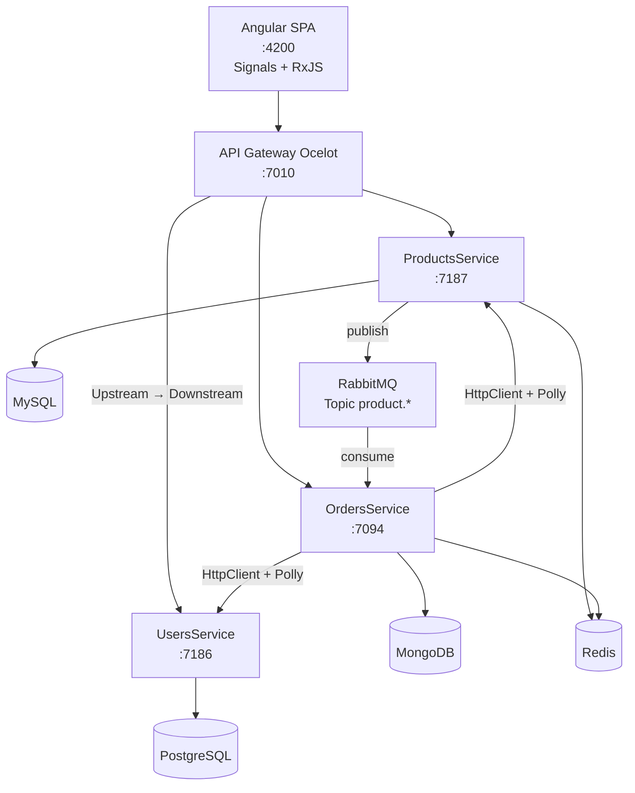

# e-Commerce Microservices

Solução de e-commerce distribuída com **3 microserviços .NET 8**, **API Gateway (Ocelot)**, **Redis**, **RabbitMQ**, frontend **Angular 21** e persistência poliglota (PostgreSQL, MySQL e MongoDB). Cada serviço possui banco próprio, deploy independente e responsabilidade de domínio bem definida.

O frontend fala **apenas com o gateway** (`:7010`). O **OrdersService** (dependant) chama **Users** e **Products** (dependencies) de forma **síncrona** via `HttpClient` + **Polly**, e mantém cache local sincronizado de forma **assíncrona** via **RabbitMQ**.



---

## Visão geral

| Serviço | Domínio | Porta | Banco / infra | Acesso |
|---------|---------|-------|---------------|--------|
| **ApiGateway (Ocelot)** | Roteamento, rate limit, file cache, QoS | `7010` | - | Upstream → Downstream |
| **UsersService** | Autenticação (register/login) | `7186` | PostgreSQL | Dapper |
| **ProductsService** | Catálogo de produtos (CRUD + busca) | `7187` | MySQL + Redis | EF Core |
| **OrdersService** | Pedidos e itens (CRUD + buscas) | `7094` | MongoDB + Redis | MongoDB Driver |
| **Redis** | Cache distribuído (`IDistributedCache`) | `6379` | Redis | StackExchange.Redis |
| **RabbitMQ** | Eventos de integração (cache sync) | `5672` / `15672` | RabbitMQ | `RabbitMQ.Client` |
| **Frontend Angular** | UI SPA (catálogo, carrinho, pedidos) | `4200` | - | HttpClient → Gateway |

---

## Estrutura do repositório

```
eCommerceMicroservice/
├── Gateway/eCommerceSolution.ApiGateway/        # API Gateway (Ocelot + Polly QoS)
├── User/eCommerceSolution.UsersService/         # Microserviço de usuários
├── Product/eCommerceSolution.ProductsService/   # Microserviço de produtos + Redis
├── Order/eCommerceSolution.OrdersService/       # Microserviço de pedidos + Polly + Redis
├── microservice/                                # Frontend Angular (via gateway :7010)
├── docker/                                      # Scripts de init dos bancos
├── docker-compose.yml                           # Orquestração local
├── .env.example                                 # Variáveis de ambiente
├── docs/
│   ├── final-project.png                        # Diagrama de arquitetura (visão geral)
│   └── architecture-microservices.png           # Diagrama complementar
└── .github/workflows/ci.yml                     # Build .NET 8 no GitHub Actions
```

---

## Arquitetura em camadas (padrão comum)

Todos os microserviços seguem **arquitetura em 3 camadas** com inversão de dependência:

```
Cliente HTTP (Angular)
    → API Gateway (Ocelot)
        → API (Controllers / Minimal APIs)
            → Service Layer (regras de negócio)
                → Repository (abstração de dados)
                    → Banco de dados
```

### Padrões utilizados

- **API Gateway** - Ocelot (Upstream/Downstream, rate limit, file cache, QoS)
- **Fault tolerance** - Polly no HttpClientFactory (dependant → dependency)
- **Distributed cache** - Redis via `IDistributedCache` + StackExchange.Redis
- **Async messaging** - RabbitMQ Topic Exchange (`product.*`) para sincronizar cache entre serviços
- **Repository Pattern** - abstrai o acesso a dados
- **Service Layer** - centraliza validação e regras de negócio
- **DTOs** - contratos de API separados das entidades (`FaultDTO` no fallback)
- **FluentValidation** - validação declarativa
- **AutoMapper** - mapeamento Request → Entity → Response
- **Exception Middleware** - respostas de erro padronizadas (`ApiErrorResponse`)
- **Dependency Injection** - extensões `AddDataAccessLayer()` / `AddCore()` / `AddBusinessLogicLayer()`

---

## Detalhes por microserviço

### UsersService

```
eCommerce.API
eCommerce.Core          → DTOs, Validators, Mappers, Services
eCommerce.Infrastructure → Dapper, PostgreSQL
```

| Método | Endpoint |
|--------|----------|
| `POST` | `/api/Auth/register` |
| `POST` | `/api/Auth/login` |
| `GET` | `/api/Users/{userID}` |

### ProductsService

```
ProductsMicroService.API
BusinessLogicLayer      → cache-aside Redis (`IDistributedCache`)
DataAccessLayer         → EF Core, MySQL
```

| Método | Endpoint |
|--------|----------|
| `GET` | `/api/products` |
| `GET` | `/api/products/search/product-id/{id}` |
| `GET` | `/api/products/search/{termo}` |
| `POST` | `/api/products` |
| `PUT` | `/api/products` |
| `DELETE` | `/api/products/{id}` |

Cache Redis: chave `$"{id}"` (com `InstanceName = Products_`) e `"all"` para o catálogo. TTL 60s. Invalidação em create/update/delete. Se o Redis cair, a leitura vai ao MySQL.

### OrdersService

```
API
BusinessLogicLayer      → Polly + HttpClientFactory + cache-aside Redis
DataAccessLayer         → MongoDB Driver
```

| Método | Endpoint |
|--------|----------|
| `GET` | `/api/Orders` |
| `GET` | `/api/Orders/search/orderid/{id}` |
| `GET` | `/api/Orders/search/userid/{id}` |
| `GET` | `/api/Orders/search/productid/{id}` |
| `GET` | `/api/Orders/search/orderDate/{data}` |
| `POST` | `/api/Orders` |
| `PUT` | `/api/Orders/{id}` |
| `DELETE` | `/api/Orders/{id}` |

**Dependant:** OrdersService. **Dependencies:** UsersService e ProductsService.

Políticas Polly combinadas (`Policy.WrapAsync`), registradas com `AddPolicyHandler` no typed `HttpClient`:

| Política | O que faz |
|----------|-----------|
| **Wait and Retry** | 3 tentativas, exponential backoff (200ms, 400ms, 800ms) em erros *transient* |
| **Timeout** | 3s por tentativa (async / pessimistic) |
| **CircuitBreaker** | abre após 3 falhas; *duration of break* 15s |
| **Bulkhead Isolation** | `MaxParallelization = 5`, `MaxQueuingActions = 10` |
| **Fallback** | devolve `FaultDTO` + header `X-Fallback: true` (HTTP 503) |

### API Gateway (Ocelot)

Ponto único para o frontend. Configuração em `ocelot.json` / `ocelot.docker.json`.

```csharp
builder.Services.AddOcelot().AddPolly();
await app.UseOcelot();
```

| Conceito | Onde |
|----------|------|
| Upstream / Downstream | cada rota em `ocelot.json` |
| `RateLimitOptions` | limite por rota (ex.: 5 GET/s em produtos) |
| `ClientWhitelist` + `ClientIdHeader` | `ClientId: admin-client` ignora o limite |
| `FileCacheOptions` (`TtlSeconds`, `Region`) | cache GET de produtos/users no gateway (15 a 20s) |
| `QoSOptions` | timeout + circuit breaker Polly no gateway |

Health check: `GET http://localhost:7010/health`

---

## Frontend Angular

SPA em **Angular 21** com **Angular Material**. Todas as URLs apontam para o **gateway**:

```typescript
apiUrl: 'http://localhost:7010/api/Auth/'
productsMicroserviceUrl: 'http://localhost:7010/api/products'
ordersMicroserviceUrl: 'http://localhost:7010/api/Orders'
```

### Observer Pattern (Signals + RxJS)

O estado da UI segue o padrão **Observer** com reatividade nativa do Angular:

| Serviço | Papel | Mecanismo |
|---------|-------|-----------|
| `CartService` | Carrinho (localStorage) | `signal` + `computed` (`itemCount`, `totalAmount`, `feedbackMessage`) |
| `ProductsService` | Catálogo em memória | `signal` + `computed` (`catalog`, `loading`, `error`, `hasProducts`) |
| Componentes | Views | Observam signals no template (`cartService.itemCount()`, `productsService.catalog()`) |
| HTTP | Chamadas à API | RxJS (`subscribe`, `tap`) |

Adicionar produto ao carrinho na vitrine atualiza o badge na sidebar **sem refresh**. Navegar entre vitrine e admin **não refaz GET**: o catálogo permanece em memória até um CRUD invalidar.

| Funcionalidade | Rota | Downstream |
|----------------|------|------------|
| Login / Cadastro | `/auth/login`, `/auth/register` | Users |
| Catálogo e busca | `/products/showcase`, `/products/search/:str` | Products |
| Admin produtos | `/admin/products` | Products |
| Carrinho | `/cart` | Local (localStorage) |
| Finalizar pedido | checkout no carrinho | Orders |
| Meus pedidos | `/orders` | Orders |
| Admin pedidos | `/admin/orders` | Orders |

Swagger continua nas portas diretas dos microserviços (não passa pelo gateway).

---

## Pré-requisitos

- [.NET 8 SDK](https://dotnet.microsoft.com/download)
- [Node.js 20+](https://nodejs.org/) (frontend)
- [Docker](https://www.docker.com/) (recomendado: bancos + Redis + stack completa)
- Ou instalações locais: MySQL, PostgreSQL, MongoDB, Redis
- Certificado de desenvolvimento HTTPS confiável (`dotnet dev-certs https --trust`) - só se for chamar as APIs em HTTPS direto

---

## Como executar

### Stack completa (recomendado)

```bash
cp .env.example .env
docker compose up --build -d
```

| Serviço | URL (HTTP) | Swagger / health |
|---------|------------|------------------|
| **Frontend Angular** | `http://localhost:4200` | - |
| **API Gateway** | `http://localhost:7010` | `/health` |
| UsersService | `http://localhost:7186` | `/swagger` |
| ProductsService | `http://localhost:7187` | `/swagger` |
| OrdersService | `http://localhost:7094` | `/swagger` |
| Redis | `localhost:6379` | - |
| RabbitMQ (Management UI) | `http://localhost:15672` | `guest` / `guest` |

```bash
docker compose logs -f
docker compose down          # volumes preservados
docker compose down -v       # reset dos dados
```

### Login admin (frontend)

| Campo | Valor |
|-------|-------|
| Email | `admin@gmail.com` |
| Senha | `admin` |

### Execução local (`dotnet run`)

Suba pelo menos Redis (e os bancos):

```bash
docker compose up postgres mysql mongodb redis -d
```

```bash
dotnet run --project User/eCommerceSolution.UsersService/eCommerce.API/eCommerce.API.csproj
dotnet run --project Product/eCommerceSolution.ProductsService/ProductsMicroService.API/ProductsMicroService.API.csproj
dotnet run --project Order/eCommerceSolution.OrdersService/API/API.csproj
dotnet run --project Gateway/eCommerceSolution.ApiGateway/ApiGateway.csproj
```

O gateway local (`ocelot.json`) encaminha para as portas HTTP:

| Downstream | Porta |
|------------|-------|
| Users | `5034` |
| Products | `5035` |
| Orders | `5194` |

Frontend:

```bash
cd microservice
npm install
npm start
```

Aplicação: `http://localhost:4200` → gateway `http://localhost:7010`

---

## Fluxo de compra (cliente)

```
1. Registro ou login        → Gateway → UsersService
2. Navegar catálogo         → Gateway → ProductsService (file cache + Redis)
3. Adicionar ao carrinho    → CartService (localStorage)
4. Finalizar pedido         → Gateway → OrdersService (POST /api/Orders)
5. Ver histórico            → Gateway → OrdersService (GET /search/userid/{id})
```

O pedido referencia `UserID` e `ProductID` **sem foreign keys entre bancos** (princípio *database per service*).

---

## Comunicação entre serviços

Dois caminhos para dados entre bounded contexts:

| Quando | Como | Exemplo |
|--------|------|---------|
| Precisa da resposta **agora** | HTTP síncrono + Polly | Validar user/produto e enriquecer pedido |
| Manter **cópia local atualizada** | RabbitMQ + Redis | Orders sincroniza cache após CRUD no Products |

### Síncrona (HttpClient + Polly)

Comunicação via typed `HttpClient` + **Polly** no OrdersService (não passa pelo gateway):

| De (dependant) | Para (dependency) | Endpoint | Uso |
|----------------|-------------------|----------|-----|
| Orders | Users | `GET /api/Users/{userID}` | Validar UserID + enriquecer `PersonName` / `Email` |
| Orders | Products | `GET /api/products/search/product-id/{productID}` | Validar ProductID + enriquecer `ProductName` / `Category` |

### Assíncrona (RabbitMQ)

Depois do commit no MySQL, o **ProductsService publica** um evento de integração. O **OrdersService consome em background** (`IHostedService`) e atualiza ou remove a chave no Redis local.

| Peça | Valor |
|------|-------|
| Exchange | `ecommerce.products` (Topic, durable) |
| Routing keys | `product.created` / `product.updated` / `product.deleted` |
| Fila | `orders.product-cache` |
| Binding | `product.*` |
| Payload | JSON `ProductEventMessage` |
| Ack | `autoAck: false` (`BasicAck` após gravar no Redis) |

Se a publicação falhar, o CRUD HTTP **não quebra** (mesmo espírito de resiliência do Redis down).


```mermaid
flowchart TB
    Angular["Angular SPA<br/>:4200<br/>Signals + RxJS"]
    Gateway["API Gateway Ocelot<br/>:7010"]

    Users["UsersService<br/>:7186"]
    Products["ProductsService<br/>:7187"]
    Orders["OrdersService<br/>:7094"]

    PG[("PostgreSQL")]
    MySQL[("MySQL")]
    Mongo[("MongoDB")]
    Redis[("Redis")]
    RMQ["RabbitMQ<br/>Topic product.*"]

    Angular --> Gateway
    Gateway -->|"Upstream → Downstream"| Users
    Gateway --> Products
    Gateway --> Orders

    Users --> PG
    Products --> MySQL
    Products --> Redis
    Products -->|"publish"| RMQ
    Orders --> Mongo
    Orders --> Redis
    RMQ -->|"consume"| Orders

    Orders -->|"HttpClient + Polly"| Users
    Orders -->|"HttpClient + Polly"| Products
```

---

## Como testar cada conceito

Com a stack no ar (`docker compose up -d`). Troque o `PRODUCT_ID` / `USER_ID` pelos valores reais do seed ou do Swagger.

### 1. Gateway - Upstream / Downstream

```bash
curl -i http://localhost:7010/health
curl -i http://localhost:7010/api/products
```

O path **upstream** (`/api/products`) é o que o frontend chama. O Ocelot encaminha **downstream** para `products-api:8080`. Compare com a chamada direta: `curl -i http://localhost:7187/api/products`.

### 2. Rate limit (`RateLimitOptions`)

O GET de produtos aceita **5 req/s**. A 6ª deve responder **429**:

Headers úteis: `X-Rate-Limit-Limit`, `Retry-After`.

### 3. Client whitelist (`ClientIdHeader`)

O cliente `admin-client` **não** é limitado:

Todos devem ser `200`. Sem o header, o limite volta a valer (identificação por IP).

### 4. File cache no gateway (`FileCacheOptions`, `TtlSeconds`, `Region`)

1. `GET http://localhost:7010/api/products` (cacheia 15s na região `products`)
2. Altere um produto **direto** no ProductsService (`PUT http://localhost:7187/api/products`)
3. `GET` de novo pelo **gateway** - ainda vê o valor antigo até o TTL
4. `GET` direto em `:7187` - já vê o valor novo
5. Após ~15s o gateway atualiza

### 5. Redis (`IDistributedCache` + StackExchange.Redis)

No ProductsService, a 1ª leitura vai ao MySQL; a 2ª usa Redis (`cacheKey = $"{id}"`).

```bash
# 1ª vez: miss → MySQL → SetString
curl -s http://localhost:7187/api/products | head -c 200; echo

# 2ª vez: hit no Redis (logs do products-api)
curl -s http://localhost:7187/api/products | head -c 200; echo

docker compose logs products-api --tail=30
redis-cli KEYS 'Products_*'
```

Update/delete invalidam `"all"` e `$"{id}"`. Se o Redis cair, o serviço continua pelo banco:

```bash
docker compose stop redis
curl -i http://localhost:7187/api/products
docker compose start redis
```

O OrdersService também faz cache-aside de `UserDTO` / `ProductDTO` nas chamadas HTTP.

### 6. Polly - Wait and Retry + Timeout (erros transient)

```bash
docker compose stop products-api
```

Liste um pedido (o Orders enriquece itens chamando Products):

```bash
curl -i http://localhost:7094/api/Orders
docker compose logs orders-api --tail=50
```

Procure `[Polly][ProductsService] WaitAndRetry #1/2/3` (exponential backoff). Depois o **Fallback** com `FaultDTO`. O pedido ainda retorna; o enriquecimento de produto fica vazio.

### 7. CircuitBreaker (`Duration of Break`)

Com o Products parado, repita a listagem de pedidos **várias vezes** (3 falhas abrem o circuito):

```bash
for i in $(seq 1 6); do curl -s -o /dev/null http://localhost:7094/api/Orders; done
docker compose logs orders-api --tail=80
```

Procure `CircuitBreaker ABERTO por 15s`. Nesse intervalo as chamadas caem direto no fallback (sem retry). Após 15s: `MEIO-ABERTO` (probe). Suba de novo:

```bash
docker compose start products-api
```

Espere o health do container e chame de novo: `CircuitBreaker FECHADO`.

### 8. Fallback + Fault DTO

Com a dependency fora, o handler Polly devolve HTTP 503 + `X-Fallback: true` + JSON `FaultDTO`:

```json
{
  "dependant": "OrdersService",
  "dependency": "ProductsService",
  "message": "ProductsService indisponível. Fallback Polly acionado.",
  "faultType": "BrokenCircuitException",
  "usedFallback": true
}
```

O typed client transforma isso em `ExternalServiceUnavailableException` (HTTP 503 no Orders, se a falha não for só no enriquecimento).

### 9. Bulkhead (`MaxParallelization`, `MaxQueuingActions`)

Mais difícil de ver no uso manual. Com 5 chamadas em paralelo e fila de 10, a 16ª é rejeitada (`BulkheadRejectedException` → fallback). Dá para forçar com vários `curl` em background enquanto o Products está lento/parado (retries ocupam o bulkhead):

```bash
docker compose stop products-api
for i in $(seq 1 20); do curl -s -o /dev/null http://localhost:7094/api/Orders & done
wait
docker compose logs orders-api --tail=100 | grep Bulkhead
docker compose start products-api
```

### 10. QoS no gateway (Ocelot + Polly)

Com o Products parado, o **gateway** também abre o circuito da rota:

```bash
docker compose stop products-api
docker compose logs api-gateway --tail=40
docker compose start products-api
```

`QoSOptions.TimeoutValue` está em **milissegundos** (10000 = 10s). `DurationOfBreak` também (5000 = 5s).

### 11. Combined policies

A ordem (outer → inner) no Orders é:

`Fallback → CircuitBreaker → WaitAndRetry → Bulkhead → Timeout`

Ou seja: cada tentativa tem timeout; o bulkhead limita concorrência; retries só acontecem com o circuito fechado; se tudo falhar, o fallback devolve `FaultDTO`.

### 12. RabbitMQ: sincronização de cache

1. Abra a Management UI: `http://localhost:15672` (`guest` / `guest`)
2. Confirme o exchange `ecommerce.products`, a fila `orders.product-cache` e o bind `product.*`
3. Em um terminal: `docker compose logs -f products-api orders-api`
4. Altere ou exclua um produto no Swagger `:7187`
5. Nos logs: `Evento updated publicado...` (Products) e cache atualizado no Orders
6. Verifique chaves Redis: `docker compose exec redis redis-cli KEYS 'Orders_*'`

Laboratório guiado: `./scripts/lab.sh`

### 13. Frontend ponta a ponta

1. Abra `http://localhost:4200`
2. Login `admin@gmail.com` / `admin`
3. Catálogo (gateway + cache)
4. Carrinho → checkout (Orders → Polly → Users/Products)
5. DevTools → Network: todas as APIs em `localhost:7010`

---

## O que este projeto ensina

| Tópico | Onde praticar |
|--------|---------------|
| Microserviços e bounded contexts | 3 serviços independentes |
| API Gateway (Ocelot) | Upstream/Downstream, um único host para o frontend |
| Rate limiting | `RateLimitOptions`, whitelist, `ClientIdHeader` |
| File cache no gateway | `FileCacheOptions` / `TtlSeconds` / `Region` |
| Fault tolerance (dependant / dependency) | Orders → Users / Products |
| Polly (retry, timeout, circuit breaker, bulkhead, fallback) | `HttpClientFactory` + `AddPolicyHandler` |
| Combined / async policies | `Policy.WrapAsync` |
| Transient faults + exponential backoff | WaitAndRetry |
| Fault DTO | fallback Polly |
| Distributed cache (Redis) | `IDistributedCache` + StackExchange.Redis |
| Async messaging (RabbitMQ) | Topic Exchange, `IHostedService` consumer, cache sync |
| Observer Pattern (frontend) | Angular Signals + computed + RxJS |
| Database per service | PostgreSQL + MySQL + MongoDB |
| Arquitetura em camadas | API / BLL / DAL em cada serviço |
| SPA multi-backend via gateway | Angular em `:4200` → `:7010` |

---
